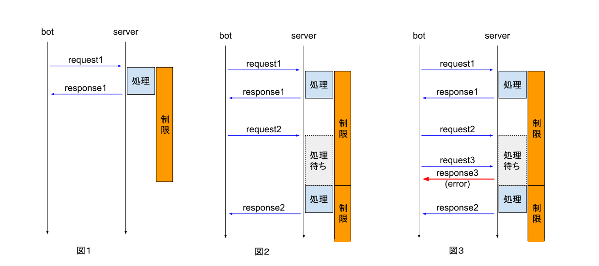

API仕様
======

以下の4種類のAPIを使用してゲームに参加します。

```
GET /api/game/{token}
GET /api/resources/{token}/{id1}-{id2}-...-{id_n}
GET /api/move/{token}/{idx}-{x}-{y}
GET /api/will_move/{token}/{idx}-{x}-{y}-{t}
```

`{token}` は ポータルサイトトップに記載されています。  
開発用環境に接続する場合は `/staging/api/*` を使用してください。詳しくは [ポータルサイトの使い方](portal.md#%E3%83%A6%E3%83%BC%E3%82%B6%E6%83%85%E5%A0%B1) をご覧ください。

ビジュアライザは以下のAPIを使用します。ビジュアライザで操作することで、移動APIが使用されることに注意してください。
```
GET /api/move/{token}/{idx}-{x}-{y}
GET /event/{token}
```

`GET /event/{token}` についてのドキュメントは提供しませんが、自作プログラムで使用することを禁止はしません。

## API制限について
すべてのAPIについて、連続でのAPI呼び出しが制限されます。制限される時間はAPIによって異なります。

API制限の詳細について説明します。



リクエストがサーバで処理されると、一定時間呼び出しの制限が行われます。(図1)  
制限時間中に新たにリクエストを送ると、制限が解除されるまで待ってから処理が行われます。(図2)  
処理待ちのリクエストが存在するときに新たにリクエストを送ると、エラーが返却されます。(図3)

また、API制限はAPIの種類ごとに独立しています。
例えば、`game` APIの制限中に `move` API を処理することができます。
ただし、`move` と `will_move` は同じ種類として扱われ、同じ制限が適用されます。

## APIの詳細
#### ゲーム情報取得API

ゲーム情報取得処理は参加者ごとに1,000ミリ秒に1回に制限されます。
`resource` フィールドの内容は、出現時刻の10,000ミリ秒前から消滅時刻までの間の資源情報が取得されます。

##### endpoint
```
GET /api/game/{token}
```
- `{token}` : ポータルサイトに記載されているトークン

##### response (成功時)

```js
{
 "status": "ok",
 "now": 12345,  // ゲーム開始からの時間 [単位ミリ秒]
 "agent": [
   {
     "move": [{"x": 2.72, "y": 3.14, "t": 12345}, {"x": 10, "y": 20, "t": 14181}]  // 回収車の移動情報 時刻tに座標(x,y)に居ることを表す
   },
   ...
 ],
 "resource": [
   {
     "id": 17,  // 資源ID
     "x": 4,  // 資源の位置(x座標)
     "y": 2,  // 資源の位置(y座標)
     "t0": 10000,  // 資源出現時刻 [単位ミリ秒]
     "t1": 16000,  // 資源消滅時刻 [単位ミリ秒]
     "type": "A",  // 資源の種類
     "weight": 10  // 1,000ミリ秒あたりの資源の回収量
   },
   ...
 ],
 "next_resource": 20000,  // 次に情報取得可能になる資源の出現時刻 [単位ミリ秒]。存在しない場合は-1
 "owned_resource": [
   {"type": "A", "amount": 0.5},  // 回収した資源の量。遅延あり
   ...
 ]
}
```

##### response (失敗時: 処理開始を待っている間に新たにゲーム情報取得処理が行われた場合)

```js
{
 "status": "error_time_limit"
}
```

##### response (ゲーム終了時)

```js
{
 "status": "game_finished"
}
```

---
#### 資源情報取得API

資源情報取得処理は参加者ごとに1,000ミリ秒に1回に制限されます。

##### endpoint

```
GET /api/resources/{token}/{id1}-{id2}-...-{id_n}
```

- `{token}` : ポータルサイトに記載されているトークン
- `{id1}-{id2}-...-{id_n}` : 資源ID ( `-` 区切り ) 1個以上20個以下

##### response (成功時)

```js
{
 "status": "ok",
 "resource": [
   {
     "id": 17,  // 資源ID
     "x": 4,  // 資源の位置(x座標)
     "y": 2,  // 資源の位置(y座標)
     "t0": 10000,  // 資源出現時刻 [単位ミリ秒]
     "t1": 16000,  // 資源消滅時刻 [単位ミリ秒]
     "type": "A",  // 資源の種類
     "weight": 10,  // 1,000ミリ秒あたりの資源の回収量
     "amount": 0.5  // 自分がこの資源から回収した量
   },
   ...
 ]
}
```

##### response (失敗時: 処理開始を待っている間に新たに資源情報取得処理が行われた場合)

```js
{
 "status": "error_time_limit"
}
```

##### response (失敗時: 指定された資源IDが20個を超える場合)

```js
{
 "status": "too_many_ids"
}
```

##### response (失敗時: 指定された資源IDが存在しない、または、出現時刻が10,000ミリ秒以上未来)

```js
{
 "status": "invalid_resource_id"
}
```

##### response (ゲーム終了時)

```js
{
 "status": "game_finished"
}
```

---
#### 移動API

移動処理は回収車ごとに `move`(即時移動) と `will_move`(予約移動) 共通で100ミリ秒に1回に制限されます。


即時移動と予約移動の違いについては、[問題概要](PROBLEM.md#即時移動と予約移動)を参照してください。

##### endpoint

```
// 即時移動処理API
GET /api/move/{token}/{idx}-{x}-{y}

// 予約移動処理API
GET /api/will_move/{token}/{idx}-{x}-{y}-{t}
```

- `{token}` : ポータルサイトに記載されているトークン
- `{idx}` : 回収車ID (1以上5以下)
- `{x}`, `{y}` : 目標位置 (それぞれ0以上30以下の整数)
- `{t}` : 移動開始時刻 (ゲーム開始からの時間 [単位ミリ秒] を指定する)

##### response (成功時)

```js
{
 "status": "ok",
 "now": 12345,  // ゲーム開始からの時間 [単位ミリ秒]
 "move": [{"x": 2.72, "y": 3.14, "t": 12345}, {"x": 10, "y": 20, "t": 14181}]  // 回収車の移動情報 時刻tに座標(x,y)に居ることを表す
}
```

##### response (失敗時: 処理開始を待っている間に新たに移動処理が行われた場合)

```js
{
 "status": "error_time_limit"
}
```

##### response (ゲーム終了時)

```js
{
 "status": "game_finished"
}
```
